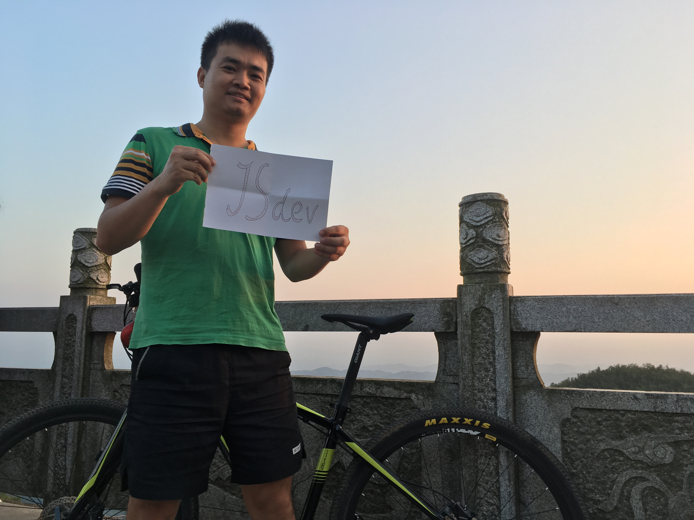

Welcome to my blog, This is Yong. I am a freelancer since 2013. I'm be addicted on front end these years, before this actually I was a JavaEE developer, at least 6 years😂 I like JavaScript, Front end is my lover.  

欢迎来到我的博客，我是曾俊勇。2013年以来一直是一个自由职业者。这些年我对前端很上瘾，实际上在此之前我是一个JavaEE开发者，至少6年了😂 我喜欢JavaScript,前端是我的最爱。

Here are my skill lists, FYI:  
这儿是我的技术列表，供参考：

- PSD2HTML (95%) `1 pixel is my target`
- CSS2,CSS3 (90%) `I can write a website without any framworks`
- Bootstrp3 (90%) `Almost most of my projects are based on it`
- Native Javascript (90%) `Didn't use it too much in my work`
- AngularJS (95%)  `Worked with it for a long time`
- Ionic (80%) `An excellent mobile component based on angular`
- Vue.js (80%) `I like it more than AngularJS`
- Angular 2 (80%)`I don't like it very much, so heavy...`
- React (20%) `JSX? I dropped it when I met it...`
- JQuery (70%) `I didn't use it cause I have AngularJS and so on`
- Node.js (70%) `Nothing to say, just a big big big platform`
- Express (85%) `Middleware is its core concept`
- Mongoose (80%) `The node.js driver for mongodb`
- Git (90%) `I will nvever change it to SVN 😏`
- Grunt, Yeoman, Gulp, Webpack (80%) `More productive with them in my life`
- OSX (90%) `All my work are in OSX`

Github: [http://github.com/zengjunyong](http://github.com/zengjunyong)  
Email: <277629199@qq.com>

At last, this is my photo. I like ridding.  
最后，这是我的照片，我喜欢骑行

